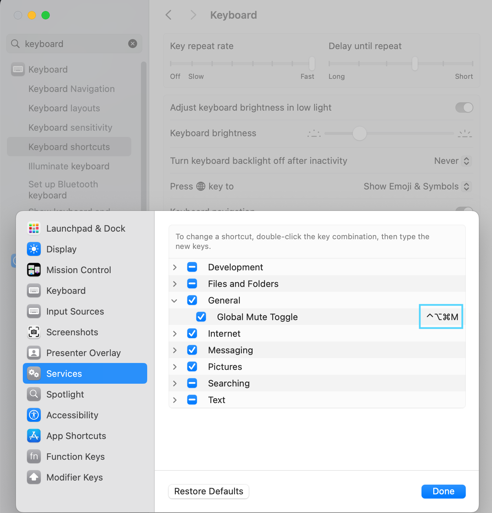

# Global Microphone Mute Toggle
A quick application to mute your microphone for macOS.

# Setup
Run

```
chmod +x setup.sh && ./setup.sh
```

After this you will need to go into MacOs settings.
Set the hotkey in the keyboard settings under 

```
Preferences > Keyboard > Shortcuts > Services > General > Global Mute Toggle
```
A recommended hotkey is `control + option + cmd + m`

